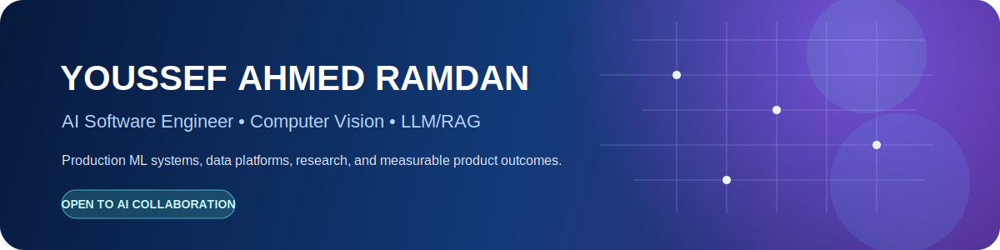
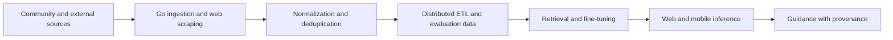

  

  
  
  
  

# Youssef Ahmed Ramdan

**AI Software Engineer | Computer Vision | LLM/RAG | Production ML Systems**

I design and ship applied AI systems that connect research, reliable data pipelines, model evaluation, and production software. My strongest specialization is **computer vision**, with additional experience in LLM/RAG systems, backend engineering, distributed data processing, and analytics.

## Focus areas

- **Computer vision:** detection, segmentation, tracking, OCR, biometric verification, liveness, image synthesis, and edge inference
- **LLM and applied AI:** RAG, embeddings, retrieval evaluation, fine-tuning, prompt engineering, model serving, and inference optimization
- **Data and ML systems:** Python/Go ingestion services, ETL, data cleaning, feature and corpus construction, evaluation pipelines, and distributed processing
- **Production engineering:** FastAPI, Django, REST APIs, Docker, Kubernetes, SQL/NoSQL, cloud deployment, and web/mobile integration
- **Analytics:** SQL, Pandas, NumPy, exploratory analysis, anomaly detection, Power BI, and Tableau
- **Research:** computer vision, OCR, biometric verification, AI software optimization, and quantum-computing optimization

## Selected work

### Problem Solving Assistant (PSA) - LLM/RAG platform

A verified-corpus assistant for competitive programmers. I designed the data path from community documentation, accepted and incorrect solutions, and external sources through web scraping, Go-based extraction, normalization, deduplication, distributed ETL, fine-tuning, evaluation, and web/mobile inference integration.

The design emphasizes data provenance, retrieval quality, measurable evaluation, and useful guidance rather than unsupported generated answers. Project results are described using internal evaluations and reported benchmarks; proprietary implementation details are available for recruiter review.

### Fintech document intelligence and risk workflows

Applied AI systems for financial-statement extraction, table understanding, transaction normalization, anomaly signals, KYC/AML workflows, biometric verification, predictive credit scoring, and reporting APIs. Work included service integration, model evaluation, and data pipelines for production-oriented automation.

### Computer-vision and generative-AI systems

Selected areas include biometric verification, document OCR, virtual try-on, body and clothing segmentation, object detection, image synthesis, style transfer, drowsiness detection, sports analysis, and cloud/edge inference.

## Technical toolkit

  

## Research

Research work includes computer vision, OCR, biometric verification, AI/software optimization, and quantum-computing optimization. Selected manuscripts are in preparation or in the publication process. Research materials and technical walkthroughs can be shared with recruiters where appropriate.

## Technology

**Languages:** Python, Go, C++, C, C#, JavaScript, PHP, SQL  
**ML/AI:** PyTorch, TensorFlow, Keras, scikit-learn, XGBoost, YOLO, Transformers  
**Backend:** FastAPI, Django, Flask, REST APIs, microservices, MongoDB  
**Data:** Pandas, NumPy, ETL, web scraping, data modeling, statistics, anomaly detection  
**Cloud/MLOps:** Docker, Kubernetes, Azure AI, AWS SageMaker, Google Cloud, model serving  
**Analytics:** Power BI, Tableau  
**Full stack:** React, Node.js, Express.js, MERN, Odoo ERP

## Engineering principles

- Build the data and evaluation path before optimizing the model.
- Preserve provenance, privacy, and reproducibility.
- Separate experiments from production services.
- Optimize for reliability, latency, maintainability, and measurable user value.
- Document trade-offs and limitations instead of hiding them.

## Leadership and community

Google Developer Group Community Organizer; TensorFlow User Group Organizer; Microsoft Learn Student Ambassador; Google Developer Student Club Lead and Technical Team Lead; AI engineering coach and mentor.

## Contact

- Email: [youssefahmed3803@gmail.com](mailto:youssefahmed3803@gmail.com)
- LinkedIn: [linkedin.com/in/youssef-ahmed-ramdan](https://www.linkedin.com/in/youssef-ahmed-ramdan)
- GitHub: [github.com/Youssef-Ahmed38](https://github.com/Youssef-Ahmed38)
- Portfolio: [youssefportfolio26.z1.web.core.windows.net](https://youssefportfolio26.z1.web.core.windows.net/)

## Recruiter case studies

- [PSA - verified LLM/RAG platform](./case-studies/psa.md)
- [Fintech document intelligence](./case-studies/fintech-document-intelligence.md)
- [Computer-vision systems](./case-studies/computer-vision.md)
- [Research and optimization](./case-studies/research.md)

> Most production work is private or confidential. For recruiting conversations, I can provide sanitized architecture diagrams, evaluation summaries, demos, and technical walkthroughs without exposing proprietary source code.
