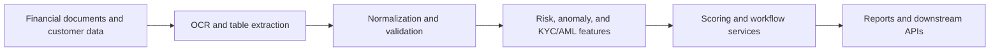

# Fintech Document Intelligence

## Summary

A production-oriented AI workflow for financial-statement extraction, table understanding, transaction normalization, anomaly signals, KYC/AML checks, biometric verification, predictive credit scoring, and reporting APIs.

## System shape

## Engineering contribution

- Designed service layers linking extraction, validation, risk signals, and reporting.
- Built analysis-ready data paths with explicit field provenance and error handling.
- Integrated model outputs into APIs and operational workflows rather than leaving them in notebooks.
- Worked with sensitive financial and biometric data, requiring privacy-aware handling and controlled access.

## Recruiter discussion points

The most important design decisions were separating extraction confidence from business decisions, preserving raw values for auditability, and making downstream workflows resilient to partial or uncertain model output.
