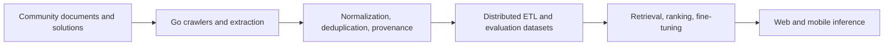

# PSA - Problem Solving Assistant

## Summary

PSA is a verified-corpus LLM/RAG platform designed to help competitive programmers learn, reason through difficult problems, and receive structured guidance instead of an unsupported answer.

## Engineering scope

I designed the path from source collection to application serving, including accepted solutions, incorrect submissions as negative examples, document chunking, retrieval metadata, evaluation records, and model-serving integration.

## Key trade-offs

- Normalized source records for integrity; denormalized retrieval views for latency.
- Batch distributed processing for corpus rebuilds; lower-latency paths for user interactions.
- Broad candidate recall followed by ranking and provenance checks to improve answer quality.
- Versioned schemas and incremental processing to support evolving sources without recomputing everything.

## Evidence and confidentiality

The project achieved a reported 90%+ solve rate on an internal benchmark, including Master-level tasks. Production implementation details remain private; a recruiter walkthrough can cover architecture, evaluation methodology, and sanitized examples.
